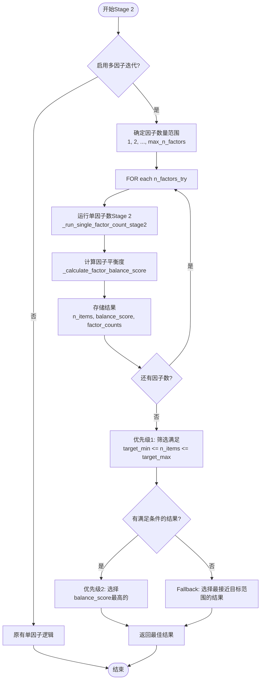

# 多因子数迭代优化实现计划

## 目标

在不同因子数量下迭代运行EFA+CFA，优先选择**条目数量在目标范围内**的结果，然后在这些结果中选择**因子平衡度最好**的。

## 优先级规则

1. **优先级1（最高）**：条目数量必须在目标范围内（`target_min <= n_items <= target_max`）
2. **优先级2**：在满足优先级1的结果中，选择因子平衡度最好的

## 实施步骤

### Step 1: 添加因子平衡度计算函数

**文件**: `utils/factor_analysis.py`**位置**: 第1587行后（`_perform_stage2_efa_cfa`之后，`select_items_by_efa_cfa`之前）**代码**: ~40行功能：计算因子结构的平衡度评分

```python
def _calculate_factor_balance_score(factor_structure: Dict[int, int]) -> Dict[str, float]:
    """
    计算因子平衡度评分
    
    返回:
    - imbalance_ratio: max/min比例（越小越好，1.0表示完全平衡）
    - balance_score: 标准化评分（0-1，越高越好）
    - max_count, min_count: 各因子条目数的最大值和最小值
    - factor_counts: 每个因子的条目数统计
    """
```

**评分算法**：

- `imbalance_ratio = max_count / min_count`
- `balance_score = exp(-(imbalance_ratio - 1.0) * 0.5)`（指数衰减）
- 比例1.0 → 评分1.0
- 比例2.0 → 评分约0.61
- 比例4.0 → 评分约0.22
- 比例≥10.0 → 评分0.0

---

### Step 2: 创建单因子数Stage 2运行函数

**文件**: `utils/factor_analysis.py`**位置**: Step 1之后**代码**: ~60行功能：封装单个因子数的完整Stage 2流程（包含adaptive_factor_loading迭代）

```python
def _run_single_factor_count_stage2(
    ratings_matrix: np.ndarray,
    items_passed_inter: List[int],
    high_corr_counts: Dict[int, int],
    min_factor_loading: float,
    n_factors_try: int,  # 要尝试的因子数量
    use_cfa: bool,
    cfa_rmsea_threshold: float,
    cfa_tli_threshold: float,
    cfa_cfi_threshold: float,
    cfa_srmr_threshold: float,
    min_items_per_factor: int,
    enable_factor_balance: bool,
    max_items_per_factor: Optional[int],
    target_range: Optional[Tuple[int, int]],
    adaptive_factor_loading: bool,
    max_adaptive_iterations: int
) -> Optional[Dict[str, Any]]:
    """
    对指定的因子数量运行完整的Stage 2流程
    
    重用现有的adaptive_factor_loading迭代逻辑，
    但使用n_factors_try而不是n_factors
    """
```

**实现逻辑**：

- 复制现有adaptive_factor_loading迭代逻辑（第1699-1810行）
- 将`n_factors`参数替换为`n_factors_try`
- 返回stage2_result或None（如果失败）

---

### Step 3: 修改主函数签名

**文件**: `utils/factor_analysis.py`**位置**: 第1589行**代码**: +3行添加新参数：

```python
def select_items_by_efa_cfa(
    ...
    # 新增参数
    try_multiple_n_factors: bool = False,  # 是否启用多因子迭代
    max_n_factors_to_try: Optional[int] = None,  # 最多尝试几个因子数（默认：基于Kaiser准则自动确定）
    prefer_balanced_factors: bool = True  # 是否优先选择平衡的结果（在满足条目数量要求的前提下）
) -> Dict[str, Any]:
```

---

### Step 4: 实现多因子迭代逻辑（核心）

**文件**: `utils/factor_analysis.py`**位置**: 第1695行后（Stage 1完成后，现有Stage 2之前）**代码**: ~120行**优先级选择逻辑**：

```python
# 伪代码逻辑
if try_multiple_n_factors and target_range and adaptive_factor_loading:
    # 1. 确定因子数量范围
    factor_range = determine_factor_range(...)  # [1, 2, 3] 或基于Kaiser准则
    
    # 2. 对每个因子数量运行Stage 2
    all_results = []
    for n_factors_try in factor_range:
        result = _run_single_factor_count_stage2(n_factors_try, ...)
        if result:
            balance_metrics = _calculate_factor_balance_score(result["factor_structure"])
            all_results.append({
                "n_factors": n_factors_try,
                "result": result,
                "n_items": len(result["selected_items"]),
                "balance_score": balance_metrics["balance_score"],
                "imbalance_ratio": balance_metrics["imbalance_ratio"],
                "factor_counts": balance_metrics["factor_counts"]
            })
    
    # 3. 优先级选择（关键逻辑）
    target_min, target_max = target_range
    
    # 3.1 优先级1：筛选满足条目数量要求的结果
    results_in_range = [r for r in all_results 
                       if target_min <= r["n_items"] <= target_max]
    
    if results_in_range:
        # 优先级2：在这些结果中选择平衡度最好的
        best_result_info = max(results_in_range, 
                              key=lambda x: x["balance_score"])
        print(f"Selected {best_result_info['n_factors']} factors: "
              f"{best_result_info['n_items']} items, "
              f"balance_score={best_result_info['balance_score']:.3f}")
    else:
        # Fallback: 如果没有结果满足条目数量要求，选择最接近的
        # 优先选择接近target_min的结果（因为条目太少比太多更糟糕）
        best_result_info = min(all_results,
                              key=lambda x: abs(x["n_items"] - target_min) 
                                           if x["n_items"] < target_min 
                                           else abs(x["n_items"] - target_max) * 1.5)
        print(f"WARNING: No result in target range. Selected closest: "
              f"{best_result_info['n_factors']} factors, "
              f"{best_result_info['n_items']} items")
    
    # 4. 返回最佳结果
    return _build_final_result(best_result_info["result"], ...)
```

**详细实现要点**：

1. **因子数量范围确定**：

- 如果`max_n_factors_to_try=None`：快速EFA检测Kaiser准则（eigenvalues >= 1），范围=[1, 2, ..., min(kaiser_result+1, 5)]
- 否则：范围=[1, 2, ..., max_n_factors_to_try]

2. **结果收集与评估**：

- 对每个因子数量调用`_run_single_factor_count_stage2`
- 计算平衡度评分
- 记录条目数量、因子分布等信息

3. **两阶段选择**：

- 阶段1：筛选`target_min <= n_items <= target_max`的结果
- 阶段2：在阶段1的结果中选择`balance_score`最高的
- Fallback：如果阶段1为空，选择最接近目标范围的结果

4. **日志输出**：

- 显示每个因子数量的尝试结果
- 显示选择依据（条目数量、平衡度）
- 如果有fallback，显示警告

---

### Step 5: 更新调用接口

**文件**: `agents/item_selection_agent.py`**位置**: 第188行（`select_items_by_efa_cfa`调用处）**代码**: +3行

```python
efa_cfa_results = select_items_by_efa_cfa(
    ...
    try_multiple_n_factors=selection_config.get("try_multiple_n_factors", False),
    max_n_factors_to_try=selection_config.get("max_n_factors_to_try", None),
    prefer_balanced_factors=selection_config.get("prefer_balanced_factors", True)
)
```

---

### Step 6: 更新配置示例

**文件**: `tests/test_single_scenario_quick.py` 或相关配置文件**位置**: `selection_config`字典定义处**代码**: +3行

```python
selection_config = {
    ...
    "try_multiple_n_factors": True,  # 启用多因子迭代
    "max_n_factors_to_try": 3,  # 最多尝试3个因子数（1, 2, 3）
    "prefer_balanced_factors": True  # 在满足条目数量要求的前提下优先平衡
}
```

---

## 数据流图



---

## 关键设计决策

### 1. 优先级实现

- **条目数量检查**：使用简单的范围判断 `target_min <= n_items <= target_max`
- **平衡度比较**：使用`max()`函数，直接比较`balance_score`
- **Fallback策略**：当没有结果满足条目数量要求时，选择最接近的（更偏向target_min）

### 2. 性能优化

- **因子数量限制**：默认最多尝试3-5个因子数，避免计算时间过长
- **早期终止**（可选，未来优化）：如果某个因子数在第一次尝试就得到完美结果，可以考虑提前终止

### 3. 错误处理

- 如果某个因子数运行失败，记录错误但继续尝试其他因子数
- 如果所有因子数都失败，回退到原有逻辑或抛出异常

### 4. 日志和可追溯性

- 记录每个因子数的尝试结果（条目数、平衡度、因子分布）
- 在最终结果中保存所有尝试的元信息，便于调试和分析

---

## 预期效果

### 当前问题

- Factor 0: 12项，Factor 1: 1项（比例12:1，极端不平衡）
- 条目数量：13项（在目标范围内）

### 预期改善

假设尝试因子数[1, 2, 3]：

- 因子数1：可能得到15项（但单因子，无平衡问题）
- 因子数2：当前结果12:1（平衡度差）
- 因子数3：可能得到10:2:1或其他分布

**如果因子数3的结果条目数在目标范围内且平衡度更好**，将选择因子数3的结果。---

## 实施顺序（优先级）

1. **P0 - 核心功能**：Step 1, Step 2, Step 4（实现基本的多因子迭代和优先级选择）
2. **P1 - 接口集成**：Step 3, Step 5（添加参数和调用接口）
3. **P2 - 配置和文档**：Step 6（更新配置示例）

---

## 测试策略

1. **单元测试**：测试`_calculate_factor_balance_score`函数