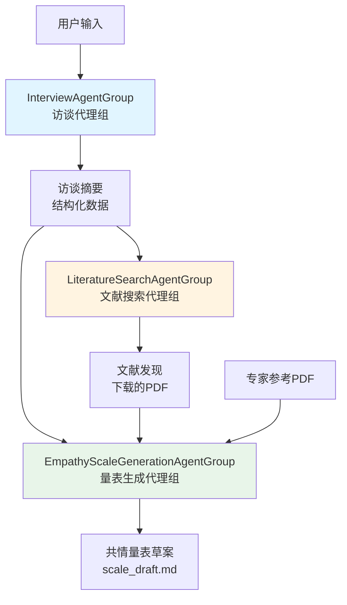
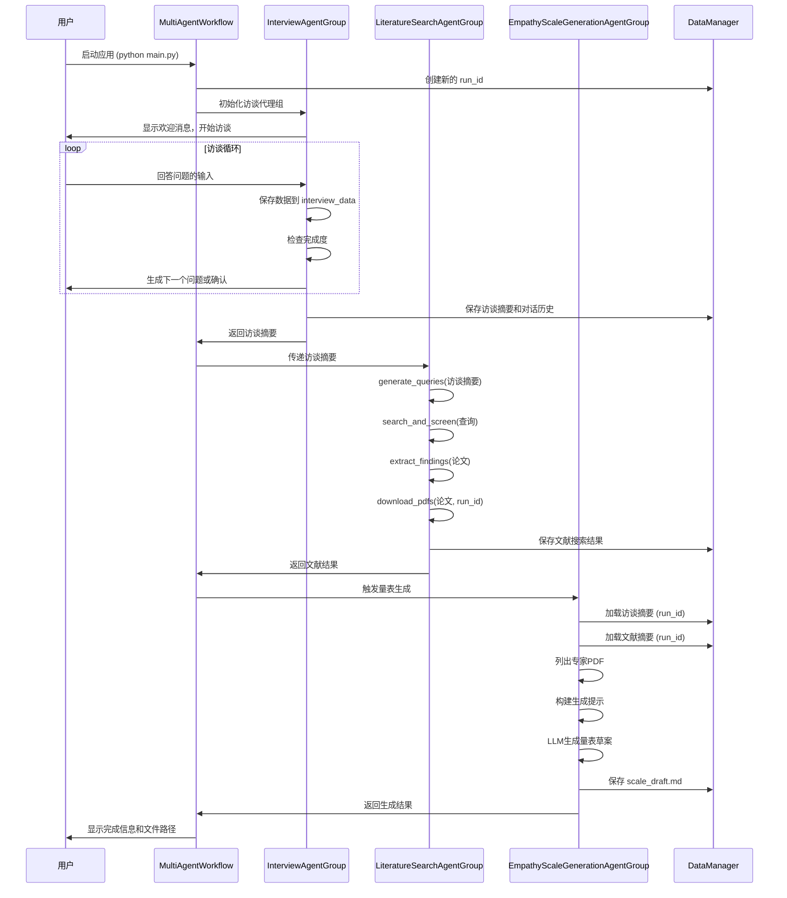

# 三个 Agent Group 架构与交互设计说明

## 系统概览

本系统采用**模块化多智能体架构**，通过三个专业化的 Agent Group 协作完成从用户访谈到共情量表生成的完整工作流程。

## 整体架构图



## 三个 Agent Group 详细设计

### 1. InterviewAgentGroup（访谈代理组）

**核心职责**：通过对话收集用户关于人机协作场景的详细信息

**内部结构**：
```
InterviewAgentGroup
├── 主代理 (LangChain AgentExecutor)
│   ├── LLM: ChatOpenAI
│   ├── 工具集:
│   │   ├── save_interview_data (保存访谈数据)
│   │   ├── get_interview_progress (获取进度)
│   │   └── delegate_to_sub_agent (委托子代理)
│   └── 对话记忆: ConversationBufferMemory
│
└── 子代理组 (4个专业化子代理)
    ├── TaskCollectorAgent (任务收集代理)
    ├── EnvironmentAnalyzerAgent (环境分析代理)
    ├── PlatformSpecialistAgent (平台专家代理)
    └── CollaborationExpertAgent (协作专家代理)
```

**数据收集字段**：
- ✅ **必需字段**：
  - `assessment_context` - 评估场景描述
  - `robot_platform` - 机器人平台信息
  - `environmental_setting` - 环境设置
- ⭐ **重要字段**：
  - `interaction_modalities` - 交互模态（语音/触摸/视觉线索等）**关键**
  - `collaboration_pattern` - 协作模式
- 📝 **补充字段**：
  - `assessment_goals` - 评估目标
  - `expected_empathy_forms` - 预期共情形式
  - `assessment_challenges` - 评估挑战
  - `measurement_requirements` - 测量要求

**工作流程**：
```
1. 启动访谈 → 显示欢迎消息
2. 用户响应 → 主代理处理
3. 使用工具 → save_interview_data 保存信息
4. 检查完成度 → 判断是否收集足够信息
5. 生成摘要 → 结构化输出访谈结果
```

**输出**：
- `summary.json` - 结构化访谈摘要
- `conversation.json` - 完整对话历史

---

### 2. LiteratureSearchAgentGroup（文献搜索代理组）

**核心职责**：基于访谈摘要进行智能文献搜索，筛选并提取相关研究

**工作流程**：
```
┌─────────────────────────────────────────┐
│ Step 1: 生成搜索查询                     │
│ - 分析访谈摘要                           │
│ - 生成5-6个针对性查询                    │
│ - 关注场景/平台/交互模态                  │
└─────────────────┬───────────────────────┘
                  ↓
┌─────────────────────────────────────────┐
│ Step 2: 搜索学术数据库                    │
│ - arXiv (机器人学、人机交互)              │
│ - Semantic Scholar (综合学术文献)        │
│ - 每个查询每个源最多20篇论文             │
└─────────────────┬───────────────────────┘
                  ↓
┌─────────────────────────────────────────┐
│ Step 3: 筛选相关论文                      │
│ - LLM评估相关性(1-5分)                  │
│ - 接受评分≥3的论文                       │
│ - 最多筛选80篇                           │
│ - 双重优先级:                            │
│   1. 如何构建感知机器人共情量表            │
│   2. 协作场景中机器人共情的理解            │
└─────────────────┬───────────────────────┘
                  ↓
┌─────────────────────────────────────────┐
│ Step 4: 提取关键发现                      │
│ - 处理最多50篇最相关论文                  │
│ - 提取:                                  │
│   • 共情定义和框架                        │
│   • 共情行为(按交互模态组织)               │
│   • 测量方法和量表构建方法                 │
│   • 交互模态洞察                          │
└─────────────────┬───────────────────────┘
                  ↓
┌─────────────────────────────────────────┐
│ Step 5: 下载PDF文件                      │
│ - 按类别组织(定义/行为/测量)              │
│ - 最多下载50篇                            │
│ - 保存到分类目录                          │
└─────────────────┬───────────────────────┘
                  ↓
┌─────────────────────────────────────────┐
│ Step 6: 整理发现                          │
│ - 结构化组织                              │
│ - 生成摘要报告                            │
└─────────────────────────────────────────┘
```

**核心方法**：
- `generate_queries(interview_summary)` - 生成搜索查询
- `search_and_screen(queries)` - 搜索并筛选
- `extract_findings(papers)` - 提取发现
- `download_pdfs(papers, run_id)` - 下载PDF
- `organize_results()` - 整理结果

**输出结构**：
```json
{
  "search_queries": [...],
  "total_papers_found": 120,
  "screened_papers": 45,
  "extracted_findings": 40,
  "pdfs_downloaded": 35,
  "organized_findings": {
    "empathy_definitions": [...],
    "empathic_behaviors": {
      "verbal": [...],
      "nonverbal": [...],
      "adaptive": [...]
    },
    "measurement_approaches": [...],
    "existing_scales": [...]
  }
}
```

---

### 3. EmpathyScaleGenerationAgentGroup（共情量表生成代理组）

**核心职责**：整合所有信息生成结构化的共情量表草案

**输入来源**：
```
┌─────────────────────────────────────┐
│ 输入1: 访谈摘要                      │
│ - assessment_context                │
│ - robot_platform                    │
│ - interaction_modalities            │
│ - collaboration_pattern             │
│ - environmental_setting             │
│ - assessment_goals                 │
│ - expected_empathy_forms            │
│ - measurement_requirements          │
└─────────────────────────────────────┘
            ↓
┌─────────────────────────────────────┐
│ 输入2: 文献发现                      │
│ - organized_findings                 │
│   • empathy_definitions              │
│   • empathic_behaviors               │
│   • measurement_approaches           │
│ - downloaded_papers (带参考文献)      │
└─────────────────────────────────────┘
            ↓
┌─────────────────────────────────────┐
│ 输入3: 专家参考PDF                   │
│ - Charrier et al. (2019) RoPE Scale │
│ - Putta et al. (2022) 量表适配       │
│ - Schmidmaier et al. (2024) PETS    │
└─────────────────────────────────────┘
            ↓
    [LLM生成量表草案]
            ↓
┌─────────────────────────────────────┐
│ 输出: scale_draft.md                │
│ - 结构化的共情量表草案                │
│ - 包含维度、项目、评分标准等          │
└─────────────────────────────────────┘
```

**工作流程**：
1. **加载数据**：
   - 从 `data/runs/{run_id}/interview_agent_group/summary.json` 加载访谈摘要
   - 从 `data/runs/{run_id}/literature_search_agent_group/summary.json` 加载文献摘要
   - 列出 `agents/expert_pdfs/` 中的专家参考PDF

2. **构建生成提示**：
   - 使用外部化提示模板
   - 整合所有输入数据
   - 格式化变量（场景、平台、模态等）

3. **生成量表**：
   - 调用 LLM 生成结构化 Markdown
   - 保存到 `data/runs/{run_id}/empathy_scale_generation_agent_group/scale_draft.md`

4. **保存摘要**：
   - 生成执行摘要（summary.json）
   - 记录使用的输入和输出路径

---

## Agent Group 之间的交互流程



## 数据流转图

```
用户输入
    ↓
[InterviewAgentGroup]
    │ 收集信息
    ↓
结构化访谈摘要 {
    assessment_context: "...",
    robot_platform: "...",
    interaction_modalities: "...",  ← 关键字段
    collaboration_pattern: "...",
    environmental_setting: "...",
    assessment_goals: [...],
    ...
}
    ↓ 传递给
[LiteratureSearchAgentGroup]
    │ 基于摘要生成查询
    ↓
搜索查询 [
    "robot empathy [场景] [平台]",
    "empathy measurement [交互模态]",
    ...
]
    │ 执行搜索
    ↓
筛选的论文列表 [
    {title, abstract, relevance_score, ...},
    ...
]
    │ 提取发现
    ↓
组织化的发现 {
    empathy_definitions: [...],
    empathic_behaviors: {
        verbal: [...],
        nonverbal: [...],
        adaptive: [...]
    },
    measurement_approaches: [...],
    downloaded_papers: [...]
}
    ↓ 传递 (连同访谈摘要)
[EmpathyScaleGenerationAgentGroup]
    │ 整合所有信息
    │ + 专家参考PDF
    ↓
共情量表草案 (Markdown)
    - 量表结构
    - 维度定义
    - 评估项目
    - 评分标准
    - 参考文献
```

## 关键设计特点

### 1. 模块化设计
- ✅ 每个 Agent Group 职责单一、边界清晰
- ✅ 通过标准化接口（摘要JSON）进行数据传递
- ✅ 易于独立测试和扩展

### 2. 外部化提示
- ✅ 所有提示存储在 `prompts/*.json` 文件中
- ✅ 支持热重载，无需修改代码
- ✅ 便于版本控制和迭代优化

### 3. 数据隔离
- ✅ 每次运行使用独立的 `run_id`（时间戳）
- ✅ 数据存储在 `data/runs/{run_id}/` 下
- ✅ 支持历史追溯和对比分析

### 4. 错误处理
- ✅ 每个阶段都有异常捕获
- ✅ 优雅降级（如查询生成失败使用备用查询）
- ✅ 详细的错误日志和用户友好的错误消息

### 5. 进度可见性
- ✅ 访谈阶段：实时显示收集的字段
- ✅ 文献搜索：显示搜索、筛选、下载进度
- ✅ 量表生成：显示生成状态和文件路径

## 文件组织

```
EmpathyScale/
├── agents/
│   ├── interview_agent_group.py          ← InterviewAgentGroup
│   ├── literature_search_agent_group.py  ← LiteratureSearchAgentGroup
│   ├── empathy_scale_generation_agent_group.py ← EmpathyScaleGenerationAgentGroup
│   └── expert_pdfs/                      ← 专家参考PDF
│
├── prompts/
│   ├── interview_agent_group.json         ← 访谈提示
│   ├── literature_search_agent_group.json ← 文献搜索提示
│   └── empathy_scale_generation_agent_group.json ← 量表生成提示
│
├── utils/
│   ├── prompt_manager.py                 ← 提示管理
│   ├── data_manager.py                    ← 数据管理
│   └── research_api.py                    ← 研究API客户端
│
└── data/runs/{run_id}/
    ├── interview_agent_group/
    │   ├── summary.json
    │   └── conversation.json
    ├── literature_search_agent_group/
    │   ├── summary.json
    │   └── pdfs/
    │       ├── definitions/
    │       ├── behaviors/
    │       └── measurement/
    └── empathy_scale_generation_agent_group/
        ├── scale_draft.md                 ← 最终输出
        └── summary.json
```

## 扩展性

系统设计支持轻松添加新的 Agent Group：

1. 创建新的 agent 文件：`agents/{name}_agent_group.py`
2. 创建对应的提示文件：`prompts/{name}_agent_group.json`
3. 在 `main.py` 的 `_initialize_agents()` 中注册
4. 在 `MultiAgentWorkflow` 中添加执行逻辑

遵循现有的架构模式，新 Agent Group 可以无缝集成到工作流中。

---

**文档版本**: 1.0  
**最后更新**: 2025-10-31


