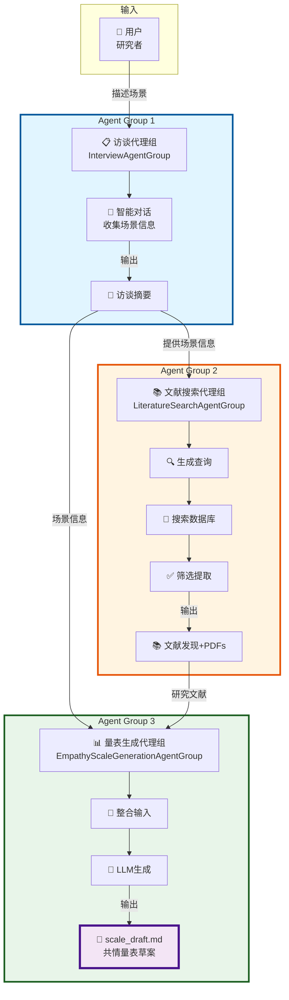
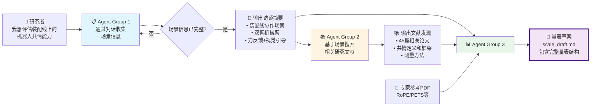

# 三个 Agent Group 架构设计 - PPT版本

## 🎯 场景示例：制造业人机协作装配

**研究目标**：评估工人在装配线上与协作机器人协作时的感知共情能力

---

## 📊 系统整体架构图



---

## 💎 三个 Agent Group 的价值定位

### 1️⃣ InterviewAgentGroup - **场景理解专家**

**核心价值**：将模糊的研究想法转化为结构化、可操作的场景描述

**合作装配场景示例**：

**用户输入（模糊）**：
> "我想研究工人在装配线上和机器人一起工作的情况"

**Agent Group 1 输出（结构化）**：
```json
{
  "assessment_context": "工人在装配线上与协作机器人协同完成精密装配任务",
  "robot_platform": "双臂机械臂，带力反馈传感器和视觉感知系统",
  "interaction_modalities": "指示灯显示、力反馈、视觉引导、声音提示",
  "collaboration_pattern": "对等协作，共享工作空间，实时协调",
  "environmental_setting": "制造车间，精密装配工位，配备安全设备"
}
```

**价值体现**：
- ✅ 自动识别关键信息（平台、交互方式、协作模式）
- ✅ 结构化存储，便于后续处理
- ✅ 4个专业子代理深度挖掘信息

---

### 2️⃣ LiteratureSearchAgentGroup - **知识挖掘专家**

**核心价值**：基于场景自动发现相关研究，提取可用的理论和方法

**工作流程（以装配场景为例）**：

```
输入：访谈摘要
  ↓
🔍 生成针对性查询：
  1. "robot empathy manufacturing assembly collaboration"
  2. "dual-arm manipulator empathy measurement force feedback"
  3. "empathy scale construction industrial human-robot interaction"
  ↓
📖 搜索数据库：
  • arXiv: 找到20篇相关论文
  • Semantic Scholar: 找到18篇相关论文
  ↓
✅ 智能筛选：
  • LLM评估相关性（1-5分）
  • 保留评分≥3的论文（45篇）
  ↓
📝 提取关键发现：
  • 共情定义：3个理论框架
  • 共情行为：15种（按力反馈/视觉/听觉分类）
  • 测量方法：5种量表构建方法
  ↓
💾 下载PDF：35篇论文，分类存储
```

**价值体现**：
- ✅ 自动化文献搜索，节省大量时间
- ✅ 智能筛选，精准定位相关研究
- ✅ 结构化提取，直接可用

---

### 3️⃣ EmpathyScaleGenerationAgentGroup - **量表设计专家**

**核心价值**：整合场景信息和研究证据，生成可直接使用的量表草案

**整合过程**：

```
📥 输入整合：
  ├─ 场景信息（访谈摘要）
  │   └─ "装配线协作，双臂机械臂，力反馈+视觉引导"
  │
  ├─ 研究证据（文献发现）
  │   ├─ 共情定义：认知共情、情感共情、行为共情
  │   ├─ 共情行为：力反馈传达意图、视觉引导减少焦虑...
  │   └─ 测量方法：Likert量表、维度设计...
  │
  └─ 专家参考（标准量表）
      └─ RoPE Scale, PETS Scale...

            ⬇️ LLM智能整合

📤 输出：完整的量表草案
  ├─ 维度1：认知共情（理解工人意图）
  ├─ 维度2：情感共情（感知工人压力）
  ├─ 维度3：行为共情
  │   ├─ 3.1 力反馈表达（轻柔/坚定传达）
  │   ├─ 3.2 视觉引导（清晰/及时指示）
  │   └─ 3.3 声音提示（警告/确认/鼓励）
  └─ 评估项目：20个Likert量表项目
```

**价值体现**：
- ✅ 基于证据设计，而非主观猜测
- ✅ 贴合具体场景（装配线协作）
- ✅ 包含完整结构（维度、项目、评分标准）

---

## 🎬 完整工作流程（以合作装配为例）



---

## 📈 三个 Agent Group 价值对比

| Agent Group | 解决的核心问题 | 输入 | 输出 | 关键价值 |
|------------|--------------|------|------|---------|
| **📋 访谈代理组** | "如何系统化理解研究场景？" | 研究者的模糊描述 | 结构化场景摘要 | 将想法转化为可操作信息 |
| **📚 文献搜索代理组** | "如何找到相关研究证据？" | 场景摘要 | 文献发现+PDFs | 自动发现知识，节省搜索时间 |
| **📊 量表生成代理组** | "如何设计科学的量表？" | 场景+文献+参考 | 量表草案 | 基于证据生成可用量表 |

---

## 🔍 实际案例：装配线协作场景的完整数据流

### Step 1: 访谈收集（Agent Group 1）

**对话示例**：
```
Agent: 请描述您要评估的人机协作场景
用户: 工人在装配线上和机器人一起组装产品

Agent: 机器人是什么类型？有哪些交互能力？
用户: 双臂机械臂，有力反馈、视觉传感器，还有LED指示灯和声音提示

Agent: 协作模式是什么样的？
用户: 对等协作，机器人和工人共享工作空间，实时协调

➡️ 输出访谈摘要...
```

**输出示例**：
```json
{
  "assessment_context": "工人在装配线上与协作机器人协同完成精密装配任务",
  "robot_platform": "双臂机械臂，带力反馈传感器和视觉感知系统",
  "interaction_modalities": "力反馈、LED指示灯、视觉引导、声音提示",
  "collaboration_pattern": "对等协作，共享工作空间，实时协调",
  "environmental_setting": "制造车间，精密装配工位"
}
```

---

### Step 2: 文献搜索（Agent Group 2）

**生成的搜索查询**：
```
1. "robot empathy manufacturing assembly peer-to-peer collaboration"
2. "dual-arm manipulator empathy force feedback visual guidance"
3. "empathy scale construction industrial human-robot interaction"
4. "perceived robot empathy measurement collaborative manufacturing"
```

**搜索结果**：
- 找到 120 篇论文
- 筛选出 45 篇相关论文（评分≥3）
- 提取 40 条关键发现
- 下载 35 篇 PDF

**关键发现示例**：
```json
{
  "empathy_definitions": [
    "共情是机器人理解并响应工人意图和需求的能力",
    "工业机器人共情包括认知、情感和行为三个维度"
  ],
  "empathic_behaviors": {
    "force_feedback": ["轻柔的力反馈传达意图", "根据工人动作调整力度"],
    "visual": ["清晰的视觉引导减少困惑", "及时的状态指示灯"],
    "auditory": ["确认性声音提示", "警告音避免碰撞"]
  }
}
```

---

### Step 3: 量表生成（Agent Group 3）

**整合后的量表草案结构**：

```markdown
# 感知协作机器人共情量表（装配线场景）

## 量表概述
用于评估工人在装配线协作中对机器人共情能力的感知...

## 维度结构

### 维度1：认知共情
- 1.1 理解工人意图（通过力反馈和视觉引导感知）
- 1.2 识别装配场景（理解当前任务状态）

### 维度2：情感共情  
- 2.1 感知工人压力（通过动作分析）
- 2.2 响应工人情绪（调整协作节奏）

### 维度3：行为共情（按交互模态）

#### 3.1 力反馈表达
- "机器人的力反馈让我清楚理解它的意图" (1-5 Likert)
- "机器人的力反馈是柔和的，不会让我感到压力" (1-5 Likert)

#### 3.2 视觉引导
- "LED指示灯的提示清晰易懂" (1-5 Likert)
- "视觉引导帮助我更快完成任务" (1-5 Likert)

#### 3.3 声音提示
- "声音提示让我及时了解机器人状态" (1-5 Likert)
- "警告音帮助我避免危险情况" (1-5 Likert)

## 评分标准
5点Likert量表：1=完全不同意，5=完全同意
```

---

## 🎯 核心优势总结

```
┌──────────────────────────────────────┐
│ 💡 自动化程度高                        │
│   从想法到量表草案，全流程自动化       │
└──────────────────────────────────────┘
              ↓
┌──────────────────────────────────────┐
│ 📚 基于研究证据                        │
│   不是主观设计，而是基于文献发现       │
└──────────────────────────────────────┘
              ↓
┌──────────────────────────────────────┐
│ 🎯 贴合具体场景                        │
│   针对装配线协作场景定制化设计         │
└──────────────────────────────────────┘
              ↓
┌──────────────────────────────────────┐
│ ⚡ 效率提升显著                        │
│   传统方法需要数周，现在只需数小时     │
└──────────────────────────────────────┘
```

---

**适用场景**：
- ✅ 制造业人机协作评估
- ✅ 医疗机器人共情测量  
- ✅ 服务机器人交互评估
- ✅ 任何需要评估机器人共情能力的研究场景

---

**文档版本**: PPT版本 1.0 | **更新日期**: 2025-10-31


