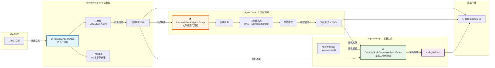
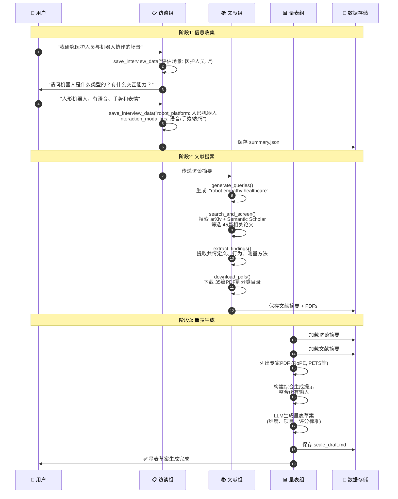

# 三个 Agent Group 架构概览图

## 整体工作流程与数据流转



## 核心交互与数据示例

### 1️⃣ InterviewAgentGroup → LiteratureSearchAgentGroup

**传递的数据示例**：
```json
{
  "assessment_context": "医护人员与机器人协作照顾患者",
  "robot_platform": "人形机器人，具有表情面部和语音能力",
  "interaction_modalities": "语音/语言、手势/动作、面部表情",
  "collaboration_pattern": "一对一互动，机器人根据患者状态自适应响应",
  "environmental_setting": "医院病房环境"
}
```

**生成的搜索查询示例**：
```
1. "robot empathy healthcare human-robot collaboration"
2. "humanoid robot empathy measurement speech gestures"
3. "empathy scale construction perceived robot empathy"
4. "adaptive robot empathy behaviors healthcare scenarios"
```

---

### 2️⃣ LiteratureSearchAgentGroup → EmpathyScaleGenerationAgentGroup

**传递的文献发现示例**：
```json
{
  "organized_findings": {
    "empathy_definitions": [
      "共情是理解和响应他人情感状态的能力...",
      "机器人共情包括认知和情感两个维度..."
    ],
    "empathic_behaviors": {
      "verbal": ["使用安慰性语言", "语调温和"],
      "nonverbal": ["点头示意", "眼神接触", "手势表达"],
      "adaptive": ["根据用户情绪调整行为", "个性化响应"]
    },
    "measurement_approaches": [
      "Likert量表评估", "行为观察", "主观报告"
    ]
  },
  "downloaded_papers": [
    {
      "title": "The RoPE Scale: A Measure of How Empathic a Robot is Perceived",
      "year": "2019",
      "category": "measurement"
    }
  ]
}
```

---

### 3️⃣ 综合生成流程

**EmpathyScaleGenerationAgentGroup 整合输入**：

```
📥 输入1: 访谈摘要
  ├─ assessment_context: "医护人员与机器人协作照顾患者"
  ├─ robot_platform: "人形机器人，具有表情面部和语音能力"
  ├─ interaction_modalities: "语音/语言、手势/动作、面部表情"
  └─ collaboration_pattern: "一对一互动，自适应响应"

📥 输入2: 文献发现
  ├─ empathy_definitions: [3个定义]
  ├─ empathic_behaviors: {verbal: [...], nonverbal: [...], adaptive: [...]}
  └─ measurement_approaches: [Likert量表, 行为观察, ...]

📥 输入3: 专家参考PDF
  ├─ RoPE Scale (Charrier et al., 2019)
  ├─ Empathy Scale Adaptation (Putta et al., 2022)
  └─ PETS Scale (Schmidmaier et al., 2024)

            ⬇️ LLM 生成整合

📤 输出: scale_draft.md
  ├─ 量表结构（维度、子维度）
  ├─ 评估项目（按交互模态分类）
  ├─ 评分标准（Likert 5点量表）
  └─ 参考文献（整合文献来源）
```

---

## 三个 Agent Group 核心能力对比

| Agent Group | 核心能力 | 关键输入 | 关键输出 | 技术特点 |
|------------|---------|---------|---------|---------|
| **InterviewAgentGroup** | 结构化信息收集 | 用户对话 | 访谈摘要JSON | LangChain工具链 + 4个子代理 |
| **LiteratureSearchAgentGroup** | 智能文献检索 | 访谈摘要 | 文献发现 + PDFs | LLM查询生成 + 双数据库搜索 |
| **EmpathyScaleGenerationAgentGroup** | 量表草案生成 | 访谈+文献+专家PDF | scale_draft.md | LLM整合生成 |

---

## 完整执行时序（含示例数据）



---

## 关键数据示例

### 访谈摘要示例（InterviewAgentGroup 输出）
```json
{
  "assessment_context": "医护人员与机器人协作照顾患者，机器人协助提供基础护理和支持",
  "robot_platform": "人形机器人，具有表达性面部特征和语音能力",
  "interaction_modalities": "语音/语言、手势/动作、面部表情",
  "collaboration_pattern": "一对一互动，机器人根据患者情绪状态自适应响应",
  "environmental_setting": "医院病房环境",
  "assessment_goals": ["评估机器人共情能力", "测量患者对机器人的信任"],
  "expected_empathy_forms": ["理解患者情绪", "适当的非语言回应"],
  "measurement_requirements": ["需要5点Likert量表", "包含多个维度"]
}
```

### 搜索查询示例（LiteratureSearchAgentGroup 生成）
```json
{
  "search_queries": [
    "robot empathy healthcare human-robot collaboration",
    "humanoid robot empathy measurement speech gestures facial expressions",
    "empathy scale construction perceived robot empathy",
    "adaptive robot empathy behaviors healthcare scenarios",
    "empathy measurement methods human-robot interaction"
  ]
}
```

### 量表草案结构示例（EmpathyScaleGenerationAgentGroup 输出）
```markdown
# 感知机器人共情量表草案

## 量表概述
基于医护人员与机器人协作场景设计的共情评估量表...

## 维度结构
1. **认知共情维度**
   - 1.1 情绪理解
   - 1.2 情境感知
   
2. **情感共情维度**
   - 2.1 情感共鸣
   - 2.2 情感响应

3. **行为共情维度**（按交互模态）
   - 3.1 语言表达（语音/语言）
   - 3.2 非语言表达（手势/动作、面部表情）

## 评估项目示例
- "机器人能够理解我的情绪状态" (1-5 Likert)
- "机器人的语言表达让我感到被理解" (1-5 Likert)
- "机器人的面部表情传达了共情" (1-5 Likert)

## 参考文献
- Charrier et al. (2019). The RoPE Scale...
- [其他文献引用]
```

---

## 系统设计核心原则

```
┌─────────────────────────────────────────┐
│ 1. 模块化设计                              │
│    每个 Agent Group 职责单一，边界清晰      │
└─────────────────────────────────────────┘
              ↓
┌─────────────────────────────────────────┐
│ 2. 数据驱动                                │
│    通过 JSON 摘要实现 Agent 间通信         │
└─────────────────────────────────────────┘
              ↓
┌─────────────────────────────────────────┐
│ 3. 外部化提示                              │
│    所有提示存储在 prompts/*.json 文件     │
└─────────────────────────────────────────┘
              ↓
┌─────────────────────────────────────────┐
│ 4. 数据隔离                                │
│    每次运行独立 run_id，支持历史追溯       │
└─────────────────────────────────────────┘
```

---

**版本**: 1.0 | **更新日期**: 2025-10-31


