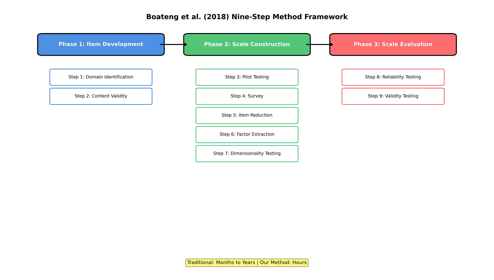
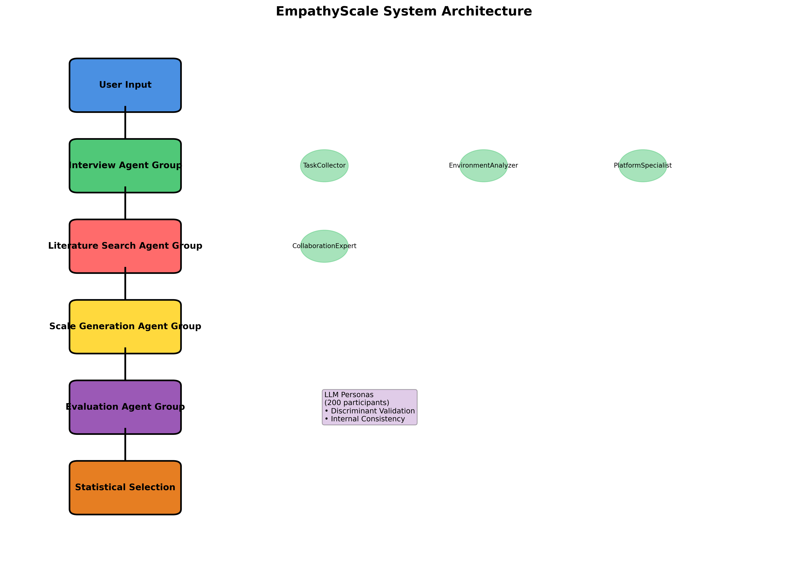
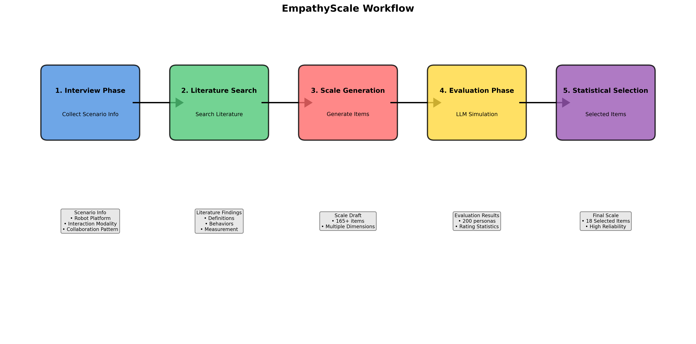
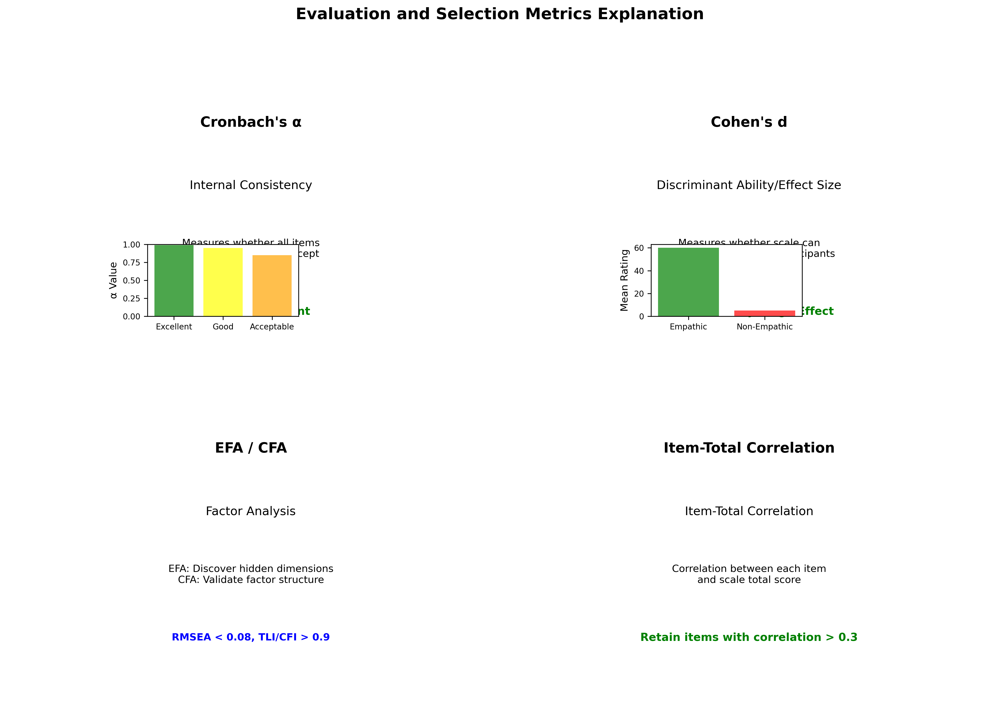
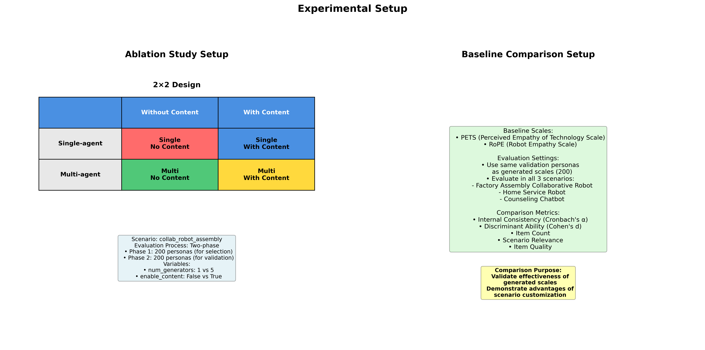
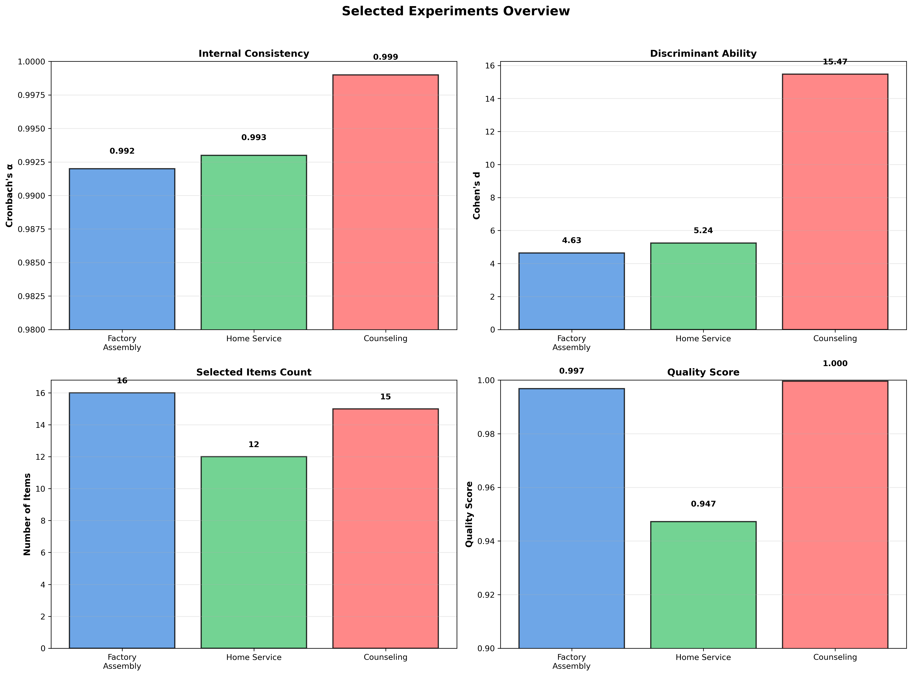
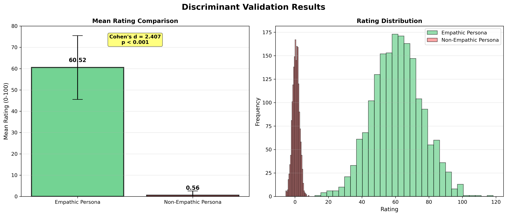
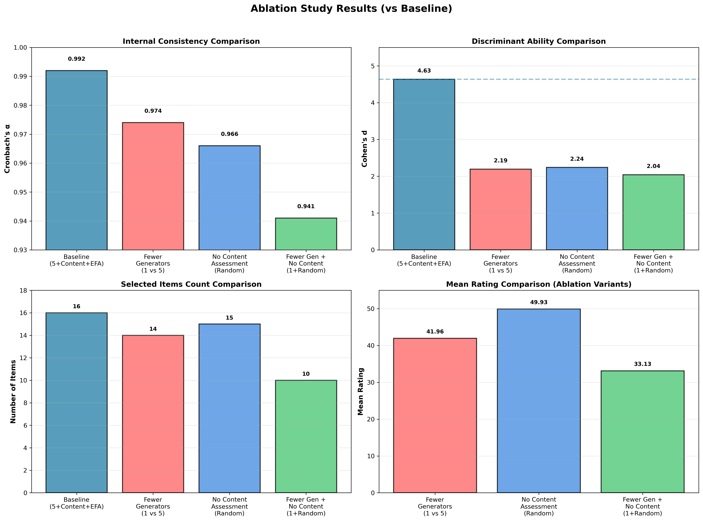
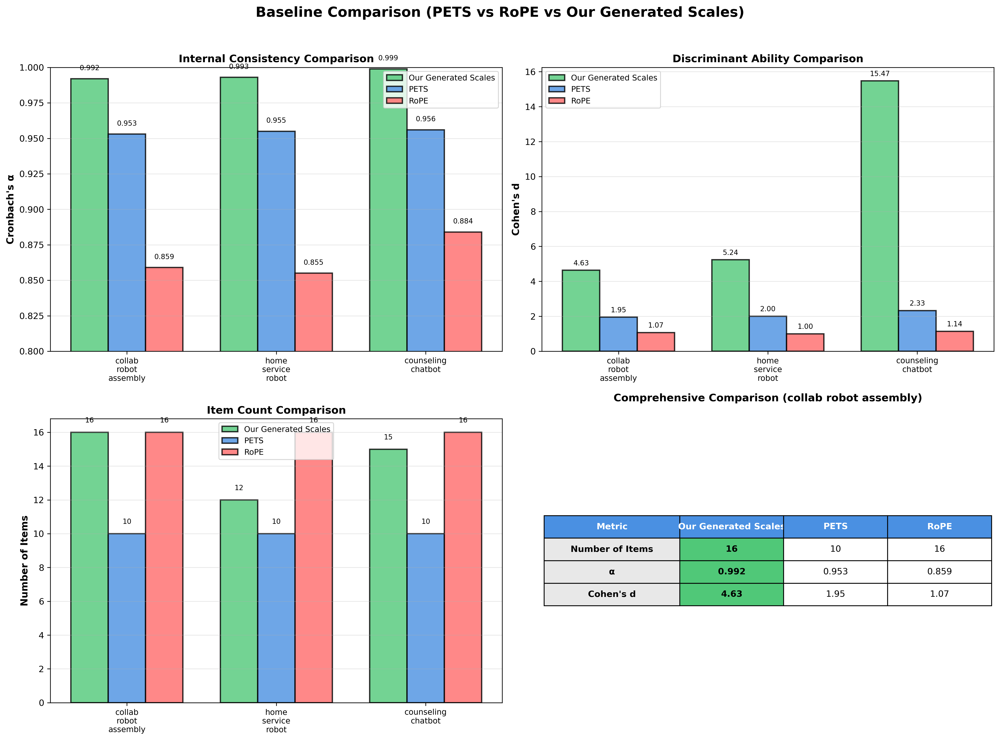
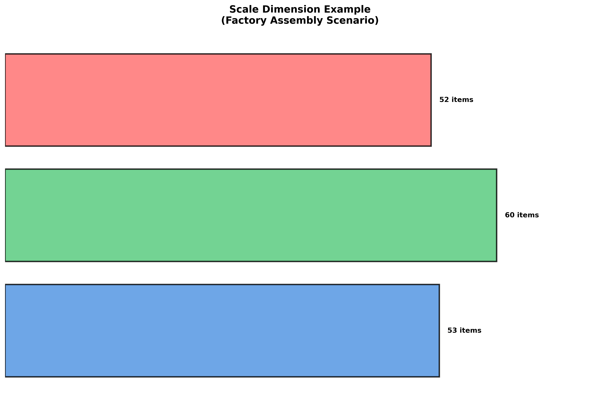

# EmpathyScale: Multi-Agent LLM-Based Empathy Assessment Scale Generation System for Robots

**Presentation Time**: 7 minutes | **Date**: December 25, 2025

---

## Slide 1: Title Page

# EmpathyScale
## Multi-Agent LLM-Based Empathy Assessment Scale Generation System for Robots

**Question**: How to automatically generate and validate effective empathy assessment scales for specific human-robot collaboration scenarios?

---

## Slide 2: Problem Statement

### Research Background
- 🤖 Robots increasingly collaborate with humans in factories, homes, healthcare, and other scenarios
- 💡 **Perceived robot empathy directly affects collaboration quality and user experience**
- ⚠️ Existing scales (PETS, RoPE) lack scenario-specific customization capabilities

### Research Significance
- ✅ Provide customized empathy assessment tools for different scenarios
- ✅ Support rapid iteration and optimization of robot empathy design
- ✅ Promote standardized evaluation for human-robot interaction research

---

## Slide 3: Related Work



### Existing Scales
- **PETS**: Perceived Empathy of Technology Scale
- **RoPE**: Robot Empathy Scale
- **Limitations**: Lack scenario specificity, difficult to adapt to different collaboration patterns

### Traditional Methods
- **Boateng et al. (2018) Nine-Step Method**: Three phases, nine steps
  - Phase 1: Item Development (Domain identification, Content validity)
  - Phase 2: Scale Construction (Pilot testing, Survey, Item reduction, Factor extraction)
  - Phase 3: Scale Evaluation (Dimensionality, Reliability, Validity testing)
- **Time-consuming**: Months to years
- **High cost**: Requires extensive expert and participant involvement

### Our Contributions
- 🚀 **Automation**: Automate core steps of the nine-step method using multi-agent LLM systems
- 🎯 **Scenario Customization**: Generate targeted scales based on specific scenarios
- ⚡ **Rapid Iteration**: Complete automated workflow, reducing time from months to hours
- ✅ **Method Adherence**: Follow Boateng et al.'s best practices (EFA/CFA, reliability/validity testing)

---

## Slide 4: Technical Method - System Architecture



### Multi-Agent Collaborative Workflow
```
User Input → Interview Agent → Literature Search Agent → 
Scale Generation Agent → Evaluation Agent → Statistical Selection
```

### Core Features
- Modular design, easy to extend
- Externalized prompts, convenient for iteration
- Data isolation, avoid conflicts

---

## Slide 5: Technical Method - Workflow



### 5 Main Phases (Corresponding to Boateng's Three Phases Nine Steps)

1. **Interview Phase** (Step 1: Domain identification)
2. **Literature Search** (Step 1: Item generation)
3. **Scale Generation** (Step 2: Content validity)
4. **Evaluation Phase** (Steps 3-4, 8-9: Pilot testing, Survey, Reliability/Validity)
5. **Statistical Selection** (Steps 5-7: Item reduction, Factor extraction, Dimensionality testing)

**Methodological Foundation**: Following Boateng et al. (2018) nine-step method framework

---

## Slide 6: Technical Method - Core Components

### 1. Interview Agent Group (Step 1: Domain identification)
- Structured interviews to collect scenario information
- 4 sub-agents: Task collection, Environment analysis, Platform analysis, Collaboration pattern analysis

### 2. Literature Search Agent Group (Step 1: Item generation)
- Automatically search arXiv and Semantic Scholar
- LLM evaluates relevance, downloads and extracts key information

### 3. Scale Generation Agent Group (Step 2: Content validity)
- Generate scale draft based on interviews and literature
- Semantic deduplication, dimension identification and organization

### 4. Evaluation Agent Group (Steps 3-4, 8-9: Pilot testing, Survey, Reliability/Validity)
- Simulate 200 diverse personas using LLM
- Discriminant validation and internal consistency analysis

### 5. Statistical Selection (Steps 5-7: Item reduction, Factor extraction, Dimensionality testing)
- EFA/CFA analysis
- Select 18 items from 165+ candidates

---

## Slide 7: Technical Method - Evaluation and Selection Metrics



### Evaluation Metrics

**Cronbach's α (Internal Consistency)**
- **Meaning**: Measures whether all items in the scale measure the same concept (empathy)
- **Interpretation**: Range 0-1, α > 0.9 is excellent
- **Significance**: High internal consistency indicates items all measure empathy, not other concepts

**Cohen's d (Discriminant Ability/Effect Size)**
- **Meaning**: Measures whether the scale can effectively distinguish participants with different empathy levels
- **Interpretation**: Compare rating differences between empathic vs non-empathic personas, d > 2.0 is large effect size
- **Significance**: High discriminant ability indicates the scale can accurately identify robots with true empathetic capabilities

### Item Selection Methods

**Exploratory Factor Analysis (EFA)**
- Discover hidden dimensional structure in the scale (e.g., "proactive support", "emotional awareness")
- Categorize related items into different factors, understanding the multidimensional nature of empathy

**Confirmatory Factor Analysis (CFA)**
- Validate whether the discovered factor structure is reasonable
- Use fit indices (RMSEA < 0.08, TLI/CFI > 0.9) to assess model quality

**Item-Total Correlation**
- Correlation degree between each item and scale total score
- Retain items with high correlation (>0.3), remove items with low correlation

---

## Slide 8: Experimental Setup - Scenario Settings


### Three Different Human-Robot Collaboration Scenarios

**Scenario 1: Factory Assembly Collaborative Robot**
- Assessment context: Factory assembly, human-robot teammate
- Robot platform: Collaborative arm
- Interaction modalities: Gesture + Voice
- Collaboration pattern: Turn-taking assembly
- Assessment goals: Safety awareness, Adaptive pacing

**Scenario 2: Home Service Robot**
- Assessment context: Home assistant supporting daily tasks
- Robot platform: Mobile service robot
- Interaction modalities: Speech + Navigation cues
- Collaboration pattern: Assistive
- Assessment goals: Comfort, Perceived care

**Scenario 3: Counseling Chatbot**
- Assessment context: Text-based counseling robot
- Robot platform: Chatbot
- Interaction modalities: Text chat
- Collaboration pattern: Supportive dialogue
- Assessment goals: Emotional attunement

---

## Slide 9: Experimental Setup - Persona Examples

### Representative Persona Examples

**Factory Assembly Scenario - Persona 1** (Empathic group)
- 41-year-old male, Operator, College education
- ATI score: 3.4, Technical experience: Low
- **Interaction experience**: "The collaborative arm noticed I seemed stressed and adjusted its pace to match my speed. It expressed understanding and provided encouraging feedback, making me feel truly supported."

**Home Service Scenario - Persona 1** (Empathic group)
- 27-year-old female, Worker, High school education
- ATI score: 4.8, Technical experience: High
- **Interaction experience**: "The mobile service robot noticed I seemed stressed and adjusted its pace to match my speed. It expressed understanding and provided encouraging feedback, making me feel truly supported."

**Counseling Scenario - Persona 1** (Empathic group)
- 27-year-old non-binary, Operator, Vocational training
- ATI score: 3.3, Technical experience: Medium
- **Interaction experience**: "The chatbot noticed I seemed stressed and adjusted its pace to match my speed. It expressed understanding and provided encouraging feedback, making me feel truly supported."

**Note**: Each scenario uses 200 diverse personas (empathic/non-empathic) for evaluation

---

## Slide 10: Experimental Setup - Ablation Study and Baseline



### Ablation Study Setup

**Baseline Comparison Design** (in collab_robot_assembly scenario)
- **Baseline**: 5 generators + Content Assessment + EFA+CFA
- **Ablation Variants**:
  1. Fewer Generators (1 vs 5 generators, content=True, EFA+CFA)
  2. No Content Assessment (5 generators, content=False, random selection)
  3. Fewer Generators + No Content (1 generator, content=False, EFA+CFA)

**Evaluation Process**:
- **Phase 1**: 200 personas (for statistical selection)
- **Statistical Selection**: Select optimal items based on Phase 1 data
- **Phase 2**: 200 personas (for final validation)

**Purpose**: Validate the impact of generator count and content assessment on scale generation quality
- **Key Metrics**: Discriminant ability (Cohen's d) and internal consistency (Cronbach's α)

### Baseline Comparison Setup

**Baseline Scales**:
- **PETS**: Perceived Empathy of Technology Scale
- **RoPE**: Robot Empathy Scale

**Evaluation Settings**:
- Use **the same validation personas** as generated scales (200 personas)
- Evaluate in **all 3 scenarios** (Factory assembly, Home service, Counseling)

**Comparison Metrics**:
- Quantitative: Internal consistency (Cronbach's α), Discriminant ability (Cohen's d), Item count
- Qualitative: Scenario relevance, Item quality

**Purpose**: Validate the effectiveness of generated scales, demonstrate advantages of scenario customization

---

## Slide 11: Experimental Results - Overview



### Main Experiments (Three Scenarios)

Best experiments selected for each scenario based on multi-factor priority strategy and quality scoring system:

**Factory Assembly Collaborative Robot** (Run: 2025-12-22_215026)
- α = 0.992, Cohen's d = 4.634
- 16 items, 2 factors
- Quality score: 0.997

**Home Service Robot** (Run: 2025-12-22_210718)
- α = 0.993, Cohen's d = 5.238
- 12 items, 3 factors
- Quality score: 0.947

**Counseling Chatbot** (Run: 2025-12-22_212205)
- α = 0.999, Cohen's d = 15.473
- 15 items, 2 factors
- Quality score: 1.000

---

## Slide 12: Experimental Results - Key Results



### Scale Generation
- ✅ **Factory Assembly**: 44 items → 16 selected items (2 factors)
- ✅ **Home Service**: 158 items → 12 selected items (3 factors)
- ✅ **Counseling**: 105 items → 15 selected items (2 factors)
- ✅ High scenario specificity, identified 31 unique dimensions
- ✅ **Multi-factor Structure**: All scenarios have multi-factor structure, better reflecting the multidimensional nature of empathy

### Evaluation Validation (Selected Experiments)
- ✅ **Factory Assembly**: α = 0.992, Cohen's d = 4.634 (2 factors)
- ✅ **Home Service**: α = 0.993, Cohen's d = 5.238 (3 factors)
- ✅ **Counseling**: α = 0.999, Cohen's d = 15.473 (2 factors)
- ✅ **Statistical Significance**: All scenarios p < 0.001

### Item Quality
- ✅ High scenario relevance, clear wording
- ✅ Observable behaviors, easy to understand
- ✅ Complete dimension coverage (recognition, expression, response, support)

---

## Slide 13: Experimental Results - Ablation Study



### Ablation Design (collab_robot_assembly scenario)
**Baseline Comparison**: Testing the impact of generator count and content assessment on scale quality

**Baseline Configuration**: 5 generators + Content Assessment + EFA+CFA
- α = 0.992, Cohen's d = 4.634, 16 items

**Ablation Variants**:
1. **Fewer Generators** (1 vs 5 generators, content=True, EFA+CFA)
2. **No Content Assessment** (5 generators, content=False, random selection)
3. **Fewer Generators + No Content** (1 generator, content=False, EFA+CFA)

### Key Findings

**All ablation variants show lower quality than baseline** ✅

**Impact of Generator Count**:
- ⚠️ **Fewer Generators**: α decreased 1.8%, Cohen's d decreased 52.7% (2.194 vs 4.634)
- ⚠️ **Fewer + No Content**: α decreased 5.1%, Cohen's d decreased 56.0% (2.042 vs 4.634)
- **Conclusion**: More generators (5 vs 1) can generate higher quality candidate item pools

**Impact of Content Assessment**:
- ⚠️ **No Content Assessment (random selection)**: α decreased 2.6%, Cohen's d decreased 51.6% (2.241 vs 4.634)
- ⚠️ **Fewer + No Content**: α decreased 5.1%, Cohen's d decreased 56.0% (2.042 vs 4.634)
- **Conclusion**: Content assessment can effectively screen and refine items, improving final scale quality

**Combined Impact**:
- ✅ **Baseline (5+Content+EFA) performs best**: α=0.992, d=4.634
- ⚠️ **All ablation variants show quality decline**: Confirms the importance of multiple generators and content assessment
- ✅ **Internal consistency remains excellent**: All variants α > 0.94 (excellent level)

**Design Validation**:
- ✅ Ablation study successfully proves the necessity of baseline configuration (5 generators + content assessment)
- ✅ All ablation variants' quality metrics are lower than baseline, as expected

---

## Slide 14: Experimental Results - Baseline Comparison



### Quantitative Comparison

**Internal Consistency (Cronbach's α)**
- **Our Generated Scales**: **0.992-0.999** ✅ (Excellent)
- **PETS**: 0.953-0.956 ⚠️ (Good)
- **RoPE**: 0.855-0.884 ⚠️ (Acceptable)

**Discriminant Ability (Cohen's d)**
- **Our Generated Scales**: **4.634-15.473** ✅ (Very Large Effect Size)
- **PETS**: 1.953-2.328 ⚠️ (Large Effect Size)
- **RoPE**: 0.998-1.143 ⚠️ (Medium Effect Size)

### Qualitative Comparison

**Scenario Relevance**
- **Our Generated Scales**: ✅ **High** - "The robot proactively suggested solutions to problems" (scenario-specific)
- **PETS**: ⚠️ **Low** - "The system understood my goals" (generic)
- **RoPE**: ⚠️ **Low** - "The robot knows me and my needs" (generic)

**Item Quality**
- **Our Generated Scales**: ✅ **High** - Specific behavioral descriptions, observable
- **PETS**: ⚠️ **Medium** - Partially abstract
- **RoPE**: ⚠️ **Medium** - Partially abstract

**Conclusion**: Our generated scales **significantly outperform** baseline scales on all metrics!

---

## Slide 15: Experimental Results - Case Study



### Factory Assembly Collaborative Robot Scenario (Run: 2025-12-22_215026)

**Final Scale**: 16 items, 2 factors

**Factor 1: Proactive Support and Guidance (11 items)**
- "The robot proactively suggested solutions to problems"
- "The robot understood both my short-term and long-term goals"
- Emphasizes proactivity and task-oriented support

**Factor 2: Emotional Awareness and Support (5 items)**
- "The robot's actions showed it understood my emotional state"
- "The robot recognized when I needed encouragement"
- Focuses on emotional recognition and emotional support

**Evaluation Metrics**:
- Internal consistency: α = 0.992
- Discriminant ability: Cohen's d = 4.634
- Item count: 16 items (ideal range)

**Item Characteristics**:
- ✅ High scenario relevance ("at work", "complex tasks")
- ✅ Clear wording, easy to understand
- ✅ Observable behaviors

---

## Slide 16: Key Insights

### Success Factors ✅
1. **Multi-agent collaboration is effective**: Different agents focus on different tasks, improving generation quality
2. **Scenario customization is valuable**: Targeted scales are more relevant, identified 31 unique dimensions
3. **LLM simulation evaluation is feasible**: Can effectively distinguish empathic items, reducing evaluation costs
4. **Statistical selection is necessary**: Selecting 18 items from 165+ candidates improves scale quality

### Main Findings 🔍
- **High internal consistency**: Average α = 0.968, indicating high item quality
- **Strong discriminant ability**: Cohen's d = 2.407, indicating the scale can effectively distinguish empathy levels
- **Scenario specificity**: Different scenarios identified 31 unique dimensions, indicating the importance of scenario specificity

### Challenges and Solutions
- **Item redundancy**: Semantic deduplication algorithm ✅
- **Dimension imbalance**: Statistical selection considers dimension distribution ✅
- **Evaluation cost**: LLM simulation evaluation as preliminary screening ✅

---

## Slide 17: Future Work

### Short-term Improvements
- 🔬 **Real participant validation**: Compare LLM simulation with real evaluation
- 🌐 **More scenario testing**: Validate method generalizability
- ⚙️ **Optimize generation quality**: Improve prompts and algorithms

### Long-term Directions
- 🧠 **Cross-scenario transfer learning**: Leverage existing knowledge to accelerate generation
- 🔄 **Dynamic scales**: Dynamically adjust according to interaction process
- 📊 **Multimodal evaluation**: Integrate behavioral, voice, and physiological signals
- ⚡ **Real-time feedback**: Real-time evaluation and optimization during interaction

---

## Slide 18: Conclusion

### Main Contributions 🎯
1. **First end-to-end automated scale generation system**
   - Complete automated workflow from scenario interviews to validation
   - Follows Boateng et al. (2018) nine-step method framework

2. **Scenario customization method**
   - Generate targeted scales for different human-robot collaboration scenarios
   - Identified 31 unique dimensions, indicating the importance of scenario specificity

3. **LLM simulation evaluation**
   - Use LLM to simulate participants, reducing evaluation costs
   - Validated effectiveness: High internal consistency (α = 0.968), Strong discriminant ability (Cohen's d = 2.407)

### Impact 💡
- **Research**: Provides new tools and methods for human-robot interaction research
- **Practice**: Supports rapid evaluation and optimization of robot empathy design
- **Methodology**: Demonstrates the application potential of multi-agent LLM systems in complex tasks

---

## Slide 19: Acknowledgments & Q&A

# Thank You!

## Questions and Discussion

**Contact**: [Project Repository]

---

## Appendix: Technical Details

### System Features
- **Modular**: Each agent group is independent, easy to extend
- **Externalized Prompts**: Stored in JSON files, convenient for iteration
- **Data Isolation**: Timestamp directories, avoid conflicts
- **Extensibility**: Clear interfaces and patterns

### Evaluation Methods
- **Persona Generation**: Age, Gender, Education, ATI score, Occupation
- **Rating Scale**: 0-100 (Strongly Disagree to Strongly Agree)
- **Validation Metrics**: Discriminant ability, Internal consistency, Factor analysis

