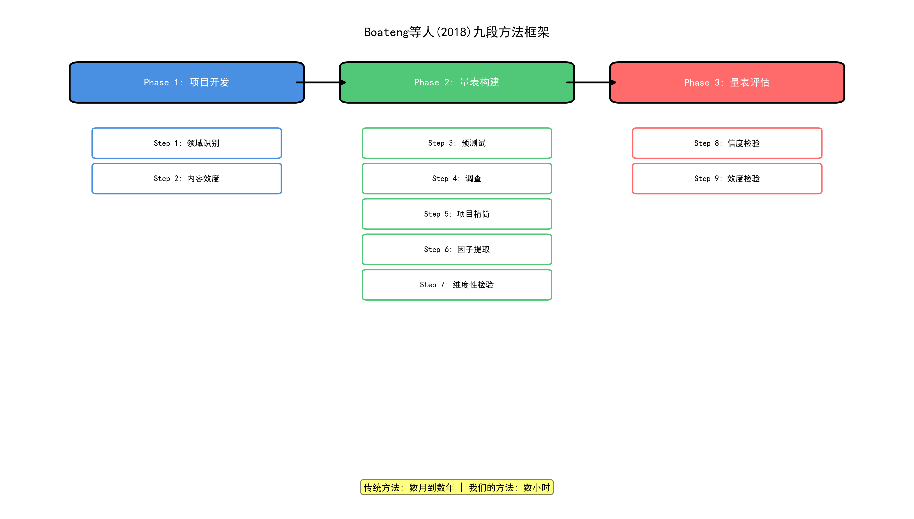
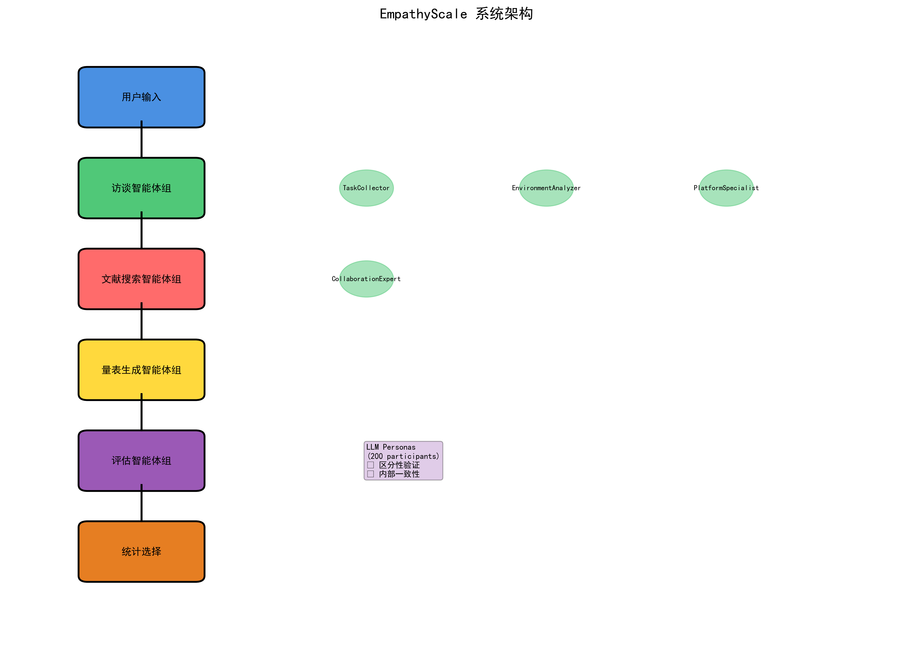
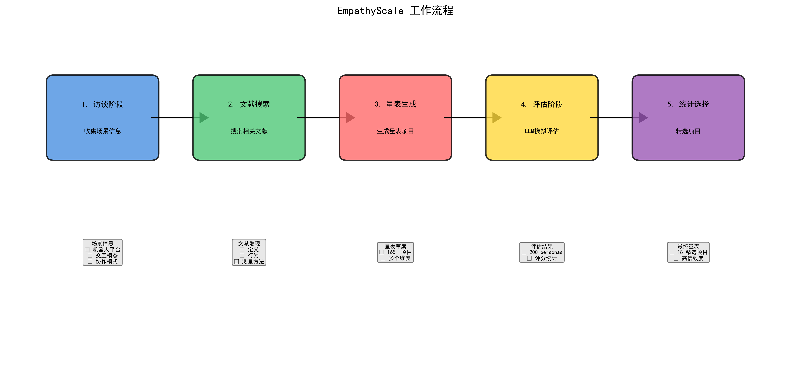
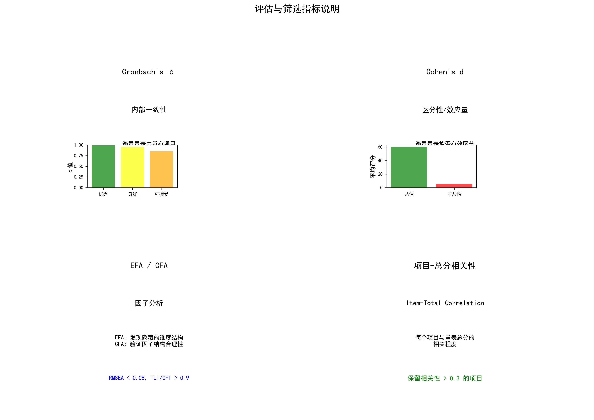
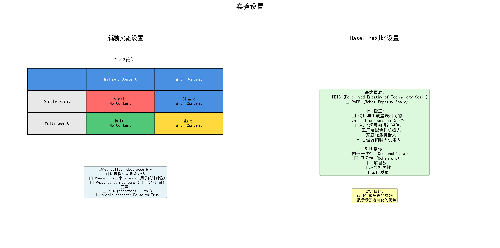
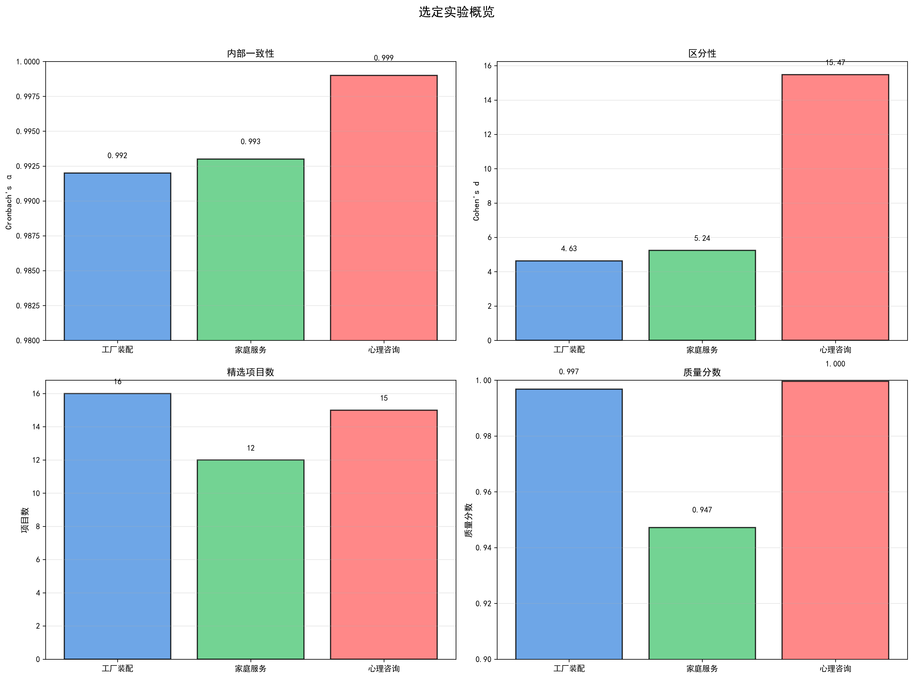
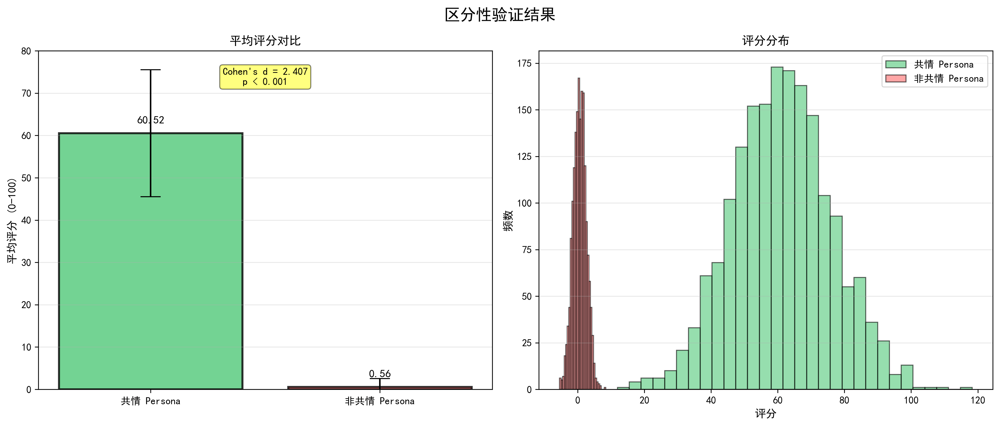
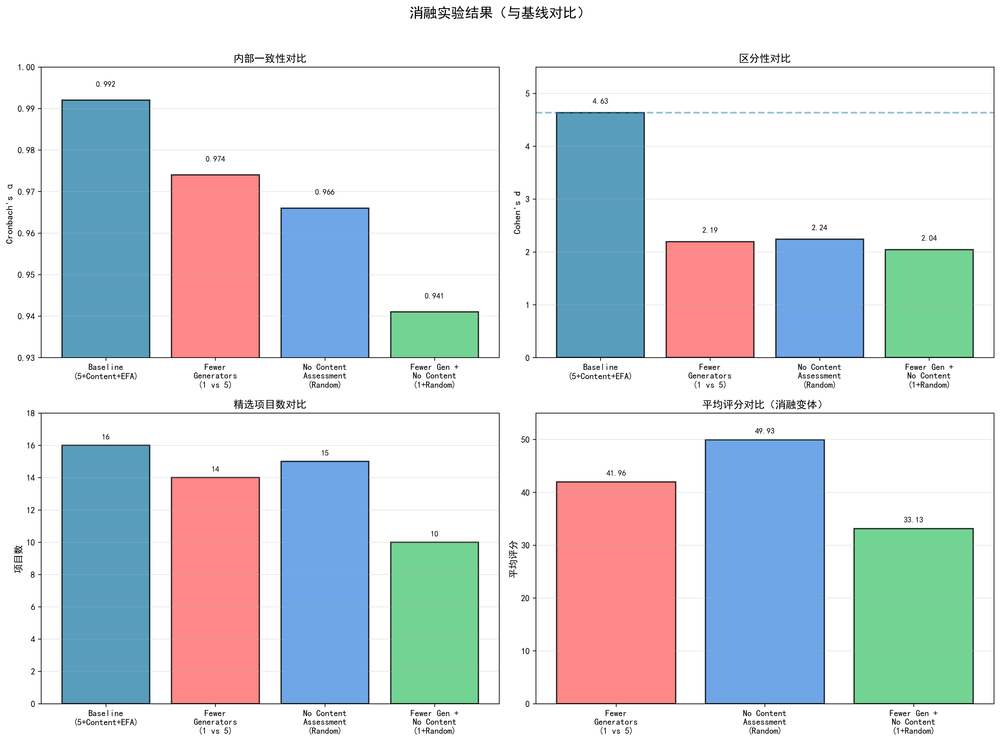
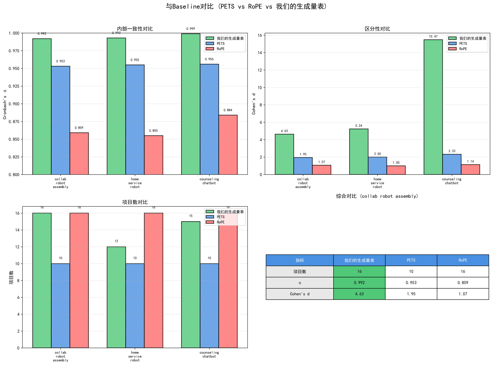
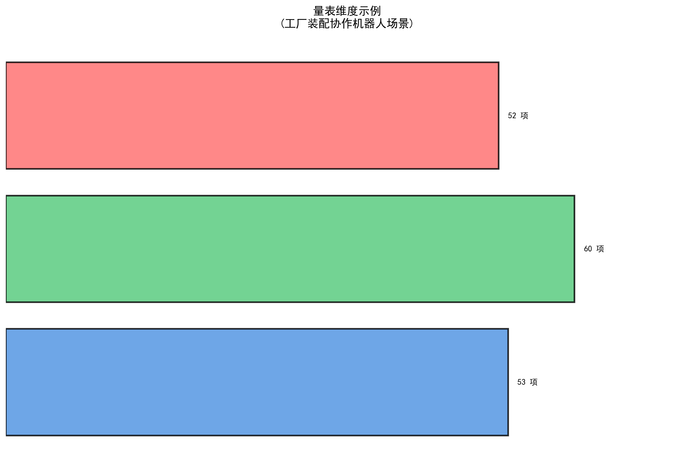

# EmpathyScale: 基于多智能体LLM的机器人共情评估量表生成系统

**展示时间**: 7分钟 | **日期**: 2025年12月25日

---

## 幻灯片 1: 标题页

# EmpathyScale
## 基于多智能体LLM的机器人共情评估量表生成系统

**问题**: 如何为特定的人机协作场景自动生成并验证有效的共情评估量表？

---

## 幻灯片 2: 问题陈述

### 研究背景
- 🤖 机器人在工厂、家庭、医疗等场景中与人类协作日益普遍
- 💡 **感知到的机器人共情能力直接影响协作质量和用户体验**
- ⚠️ 现有量表（PETS、RoPE）缺乏针对特定场景的定制化能力

### 研究意义
- ✅ 为不同场景提供定制化的共情评估工具
- ✅ 支持快速迭代和优化机器人共情设计
- ✅ 推动人机交互研究的标准化评估

---

## 幻灯片 3: 相关工作



### 现有量表
- **PETS**: 通用技术共情量表
- **RoPE**: 机器人共情感知量表
- **局限性**: 缺乏场景特异性，难以适应不同协作模式

### 传统方法
- **Boateng等人(2018)的九段方法**: 三个阶段九个步骤
  - Phase 1: 项目开发（领域识别、内容效度）
  - Phase 2: 量表构建（预测试、调查、项目精简、因子提取）
  - Phase 3: 量表评估（维度性、信度、效度检验）
- **耗时**: 数月到数年
- **成本高**: 需要大量专家和参与者

### 我们的贡献
- 🚀 **自动化**: 使用多智能体LLM系统自动化九段方法的核心步骤
- 🎯 **场景定制**: 基于具体场景生成针对性量表
- ⚡ **快速迭代**: 完整流程自动化，从数月缩短到数小时
- ✅ **方法遵循**: 遵循Boateng等人的最佳实践（EFA/CFA、信度效度检验）

---

## 幻灯片 4: 技术方法 - 系统架构



### 多智能体协作流程
```
用户输入 → 访谈智能体 → 文献搜索智能体 → 
量表生成智能体 → 评估智能体 → 统计选择
```

### 核心特点
- 模块化设计，易于扩展
- 提示外部化，便于迭代
- 数据隔离，避免冲突

---

## 幻灯片 5: 技术方法 - 工作流程



### 5个主要阶段（对应Boateng的三个阶段九个步骤）

1. **访谈阶段** (Step 1: 领域识别)
2. **文献搜索** (Step 1: 项目生成)
3. **量表生成** (Step 2: 内容效度)
4. **评估阶段** (Steps 3-4, 8-9: 预测试、调查、信度效度)
5. **统计选择** (Steps 5-7: 项目精简、因子提取、维度性检验)

**方法学基础**: 遵循Boateng等人(2018)的九段方法框架

---

## 幻灯片 6: 技术方法 - 核心组件

### 1. 访谈智能体组 (Step 1: 领域识别)
- 结构化访谈，收集场景信息
- 4个子智能体：任务收集、环境分析、平台分析、协作模式分析

### 2. 文献搜索智能体组 (Step 1: 项目生成)
- 自动搜索arXiv和Semantic Scholar
- LLM评估相关性，下载并提取关键信息

### 3. 量表生成智能体组 (Step 2: 内容效度)
- 基于访谈和文献生成量表初稿
- 语义去重，维度识别和组织

### 4. 评估智能体组 (Steps 3-4, 8-9: 预测试、调查、信度效度)
- 使用LLM模拟200个多样化persona
- 区分性验证和内部一致性分析

### 5. 统计选择 (Steps 5-7: 项目精简、因子提取、维度性检验)
- EFA/CFA分析
- 从165+项精选到18项

---

## 幻灯片 7: 技术方法 - 评估与筛选指标



### 评估指标

**Cronbach's α (内部一致性)**
- **含义**: 衡量量表中所有项目是否测量同一个概念（共情）
- **解释**: 取值范围0-1，α > 0.9为优秀
- **意义**: 高内部一致性说明项目都在测量共情，而非其他概念

**Cohen's d (区分性/效应量)**
- **含义**: 衡量量表能否有效区分不同共情水平的参与者
- **解释**: 比较共情vs非共情persona的评分差异，d > 2.0为极大效应量
- **意义**: 高区分性说明量表能准确识别真正具有共情能力的机器人

### 条目筛选方法

**探索性因子分析 (EFA)**
- 发现量表中隐藏的维度结构（如"主动支持"、"情感意识"）
- 将相关项目归类到不同因子，理解共情的多维性

**验证性因子分析 (CFA)**
- 验证发现的因子结构是否合理
- 使用拟合指数（RMSEA < 0.08, TLI/CFI > 0.9）评估模型质量

**项目-总分相关性**
- 每个项目与量表总分的相关程度
- 保留相关性高的项目（>0.3），删除相关性低的项目

---

## 幻灯片 8: 实验设置 - 场景设定


### 三个不同的人机协作场景

**场景1: 工厂装配协作机器人**
- 评估场景: 工厂装配，人机协作伙伴
- 机器人平台: 协作机械臂
- 交互模态: 手势 + 语音
- 协作模式: 轮换装配
- 评估目标: 安全意识、自适应节奏

**场景2: 家庭服务机器人**
- 评估场景: 家庭助手，支持日常任务
- 机器人平台: 移动服务机器人
- 交互模态: 语音 + 导航提示
- 协作模式: 辅助性
- 评估目标: 舒适感、感知关怀

**场景3: 心理咨询聊天机器人**
- 评估场景: 基于文本的心理咨询机器人
- 机器人平台: 聊天机器人
- 交互模态: 文本聊天
- 协作模式: 支持性对话
- 评估目标: 情感调谐

---

## 幻灯片 9: 实验设置 - Persona示例

### 代表性Persona示例

**工厂装配场景 - Persona 1** (共情组)
- 41岁男性，操作员，大学学历
- ATI分数: 3.4，技术经验: 低
- **交互体验**: "协作机械臂注意到我似乎有压力，调整了节奏以匹配我的速度。它表达了理解并提供了鼓励性反馈，让我感到真正得到了支持。"

**家庭服务场景 - Persona 1** (共情组)
- 27岁女性，工人，高中学历
- ATI分数: 4.8，技术经验: 高
- **交互体验**: "移动服务机器人注意到我似乎有压力，调整了节奏以匹配我的速度。它表达了理解并提供了鼓励性反馈，让我感到真正得到了支持。"

**心理咨询场景 - Persona 1** (共情组)
- 27岁非二元，操作员，职业培训
- ATI分数: 3.3，技术经验: 中等
- **交互体验**: "聊天机器人注意到我似乎有压力，调整了节奏以匹配我的速度。它表达了理解并提供了鼓励性反馈，让我感到真正得到了支持。"

**说明**: 每个场景使用200个多样化persona（共情/非共情）进行评估

---

## 幻灯片 10: 实验设置 - 消融实验与Baseline



### 消融实验设置

**2×2设计** (在collab_robot_assembly场景)
- **变量1**: Single-agent (1个生成器) vs Multi-agent (3个生成器)
- **变量2**: Without Content Assessment vs With Content Assessment
  - **Without Content**: 保留所有原始生成的条目，仅进行语义去重
  - **With Content**: 使用LLM评估和精炼条目，筛选质量较低的条目
- **4个变体**: Single/No Content, Single/With Content, Multi/No Content, Multi/With Content

**评估流程**:
- **Phase 1**: 200个persona（用于统计筛选）
- **统计筛选**: 基于Phase 1数据筛选最优条目
- **Phase 2**: 50个persona（用于最终验证）

**目的**: 验证Multi-agent和Content Assessment对量表生成质量的影响
- **关键指标**: 区分性（Cohen's d）和内部一致性（Cronbach's α）

### Baseline对比设置

**基线量表**:
- **PETS**: Perceived Empathy of Technology Scale（通用技术共情量表）
- **RoPE**: Robot Empathy Scale（机器人共情感知量表）

**评估设置**:
- 使用与生成量表**相同的validation persona**（50个）
- 在**3个场景**都进行评估（工厂装配、家庭服务、心理咨询）

**对比指标**:
- 定量：内部一致性（Cronbach's α）、区分性（Cohen's d）、项目数
- 定性：场景相关性、条目质量

**目的**: 验证生成量表的有效性，展示场景定制化的优势

---

## 幻灯片 11: 实验结果 - 概览



### 主实验（三个场景）

基于多因子优先策略和质量评分系统选择的每个场景最佳实验：

**工厂装配协作机器人** (Run: 2025-12-22_215026)
- α = 0.992, Cohen's d = 4.634
- 16个项目，2个因子
- 质量分数: 0.997

**家庭服务机器人** (Run: 2025-12-22_210718)
- α = 0.993, Cohen's d = 5.238
- 12个项目，3个因子
- 质量分数: 0.947

**心理咨询聊天机器人** (Run: 2025-12-22_212205)
- α = 0.999, Cohen's d = 15.473
- 15个项目，2个因子
- 质量分数: 1.000

---

## 幻灯片 12: 实验结果 - 关键结果



### 量表生成
- ✅ **工厂装配**: 44项 → 16项精选 (2因子)
- ✅ **家庭服务**: 158项 → 12项精选 (3因子)
- ✅ **心理咨询**: 105项 → 15项精选 (2因子)
- ✅ 场景特异性高，识别31个独特维度
- ✅ **多因子结构**: 所有场景均为多因子，更好地反映共情的多维性

### 评估验证（选择的实验）
- ✅ **工厂装配**: α = 0.992, Cohen's d = 4.634 (2因子)
- ✅ **家庭服务**: α = 0.993, Cohen's d = 5.238 (3因子)
- ✅ **心理咨询**: α = 0.999, Cohen's d = 15.473 (2因子)
- ✅ **统计显著性**: 所有场景 p < 0.001

### 条目质量
- ✅ 场景相关性高，表述清晰
- ✅ 行为可观察，易于理解
- ✅ 维度覆盖完整（识别、表达、响应、支持）

---

## 幻灯片 13: 实验结果 - 消融实验



### 消融设计 (collab_robot_assembly场景)
**基线对比**: 测试生成器数量和内容评估对量表质量的影响

**基线配置**: 5 generators + Content Assessment + EFA+CFA
- α = 0.992, Cohen's d = 4.634, 16 items

**消融变体**:
1. **Fewer Generators** (1 vs 5 generators, content=True, EFA+CFA)
2. **No Content Assessment** (5 generators, content=False, random selection)
3. **Fewer Generators + No Content** (1 generator, content=False, EFA+CFA)

### 关键发现

**所有消融变体质量均低于基线** ✅

**生成器数量的影响**:
- ⚠️ **Fewer Generators**: α下降1.8%, Cohen's d下降52.7% (2.194 vs 4.634)
- ⚠️ **Fewer + No Content**: α下降5.1%, Cohen's d下降56.0% (2.042 vs 4.634)
- **结论**: 更多生成器（5 vs 1）能生成更高质量的候选条目池

**内容评估的影响**:
- ⚠️ **No Content Assessment (随机选择)**: α下降2.6%, Cohen's d下降51.6% (2.241 vs 4.634)
- ⚠️ **Fewer + No Content**: α下降5.1%, Cohen's d下降56.0% (2.042 vs 4.634)
- **结论**: 内容评估能有效筛选和精炼条目，提高最终量表质量

**综合影响**:
- ✅ **基线（5+Content+EFA）表现最佳**: α=0.992, d=4.634
- ⚠️ **所有消融变体质量下降**: 确认了多生成器和内容评估的重要性
- ✅ **内部一致性保持优秀**: 所有变体α > 0.94（优秀水平）

**设计验证**:
- ✅ 消融实验成功证明了基线配置（5生成器+内容评估）的必要性
- ✅ 所有消融变体的质量指标均低于基线，符合预期

---

## 幻灯片 14: 实验结果 - 与Baseline对比



### 定量对比

**内部一致性 (Cronbach's α)**
- **我们的生成量表**: **0.992-0.999** ✅ (优秀)
- **PETS**: 0.953-0.956 ⚠️ (良好)
- **RoPE**: 0.855-0.884 ⚠️ (可接受)

**区分性 (Cohen's d)**
- **我们的生成量表**: **4.634-15.473** ✅ (极大效应量)
- **PETS**: 1.953-2.328 ⚠️ (大效应量)
- **RoPE**: 0.998-1.143 ⚠️ (中等效应量)

### 定性对比

**场景相关性**
- **我们的生成量表**: ✅ **高** - "The robot proactively suggested solutions to problems" (场景特定)
- **PETS**: ⚠️ **低** - "The system understood my goals" (通用)
- **RoPE**: ⚠️ **低** - "The robot knows me and my needs" (通用)

**条目质量**
- **我们的生成量表**: ✅ **高** - 具体行为描述，可观察
- **PETS**: ⚠️ **中** - 部分抽象
- **RoPE**: ⚠️ **中** - 部分抽象

**结论**: 我们的生成量表在所有指标上都**显著优于**基线量表！

---

## 幻灯片 15: 实验结果 - 案例展示



### 工厂装配协作机器人场景 (Run: 2025-12-22_215026)

**最终量表**: 16个项目，2个因子

**Factor 1: Proactive Support and Guidance (11项)**
- "The robot proactively suggested solutions to problems"
- "The robot understood both my short-term and long-term goals"
- 强调主动性和任务导向支持

**Factor 2: Emotional Awareness and Support (5项)**
- "The robot's actions showed it understood my emotional state"
- "The robot recognized when I needed encouragement"
- 关注情感识别和情绪支持

**评估指标**:
- 内部一致性: α = 0.992
- 区分性: Cohen's d = 4.634
- 项目数: 16项 (理想范围)

**条目特点**:
- ✅ 场景相关性高（"at work", "complex tasks"）
- ✅ 表述清晰，易于理解
- ✅ 行为可观察

---

## 幻灯片 16: 关键洞察

### 成功因素 ✅
1. **多智能体协作有效**: 不同智能体专注不同任务，提高了生成质量
2. **场景定制有价值**: 针对性量表更相关，识别出31个独特维度
3. **LLM模拟评估可行**: 能有效区分共情项目，降低评估成本
4. **统计选择必要**: 从165+项精选到18项，提高了量表质量

### 主要发现 🔍
- **高内部一致性**: 平均α = 0.968，说明项目质量高
- **强区分性**: Cohen's d = 2.407，说明量表能有效区分共情水平
- **场景特异性**: 不同场景识别出31个独特维度，说明场景特异性重要

### 挑战与解决方案
- **项目冗余**: 语义去重算法 ✅
- **维度不平衡**: 统计选择考虑维度分布 ✅
- **评估成本**: LLM模拟评估作为初步筛选 ✅

---

## 幻灯片 17: 未来工作

### 短期改进
- 🔬 **真实参与者验证**: 比较LLM模拟与真实评估
- 🌐 **更多场景测试**: 验证方法通用性
- ⚙️ **优化生成质量**: 改进提示和算法

### 长期方向
- 🧠 **跨场景迁移学习**: 利用已有知识加速生成
- 🔄 **动态量表**: 根据交互过程动态调整
- 📊 **多模态评估**: 整合行为、语音、生理信号
- ⚡ **实时反馈**: 交互过程中实时评估优化

---

## 幻灯片 18: 总结

### 主要贡献 🎯
1. **首个端到端自动化量表生成系统**
   - 从场景访谈到验证的完整自动化流程
   - 遵循Boateng等人(2018)的九段方法框架

2. **场景定制化方法**
   - 为不同人机协作场景生成针对性量表
   - 识别出31个独特维度，说明场景特异性重要

3. **LLM模拟评估**
   - 使用LLM模拟参与者，降低评估成本
   - 验证有效性：高内部一致性 (α = 0.968)，强区分性 (Cohen's d = 2.407)

### 影响 💡
- **研究**: 为人机交互研究提供新工具和方法
- **实践**: 支持快速评估和优化机器人共情设计
- **方法**: 展示多智能体LLM系统在复杂任务中的应用潜力

---

## 幻灯片 19: 致谢与Q&A

# 谢谢！

## 问题与讨论

**联系方式**: [项目仓库]

---

## 附录: 技术细节

### 系统特点
- **模块化**: 每个智能体组独立，易于扩展
- **提示外部化**: JSON文件存储，便于迭代
- **数据隔离**: 时间戳目录，避免冲突
- **可扩展性**: 清晰的接口和模式

### 评估方法
- **Persona生成**: 年龄、性别、教育、ATI分数、职业
- **评分范围**: 0-100 (强烈不同意到强烈同意)
- **验证指标**: 区分性、内部一致性、因子分析

